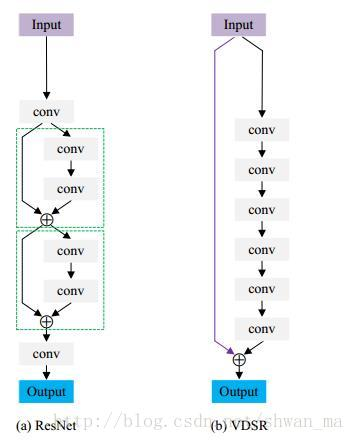

### Networks in Networks and 1x1 Convolutions


__1x1 convolution operation__ is actually doing a pretty non-trival operation and it allows to shrink the number of channels in the volumes or keep it the same or even increase it if needed.


### Inception Network Motivation


```python
from keras.models import Model
from keras.layers import Input,Dense,Dropout,BatchNormalization,Conv2D,MaxPooling2D,AveragePooling2D,concatenate
from keras.layers.convolutional import Conv2D,MaxPooling2D,AveragePooling2D

def Conv2d_BN(x, nb_filter,kernel_size, padding='same',strides=(1,1),name=None):
    if name is not None:
        bn_name = name + '_bn'
        conv_name = name + '_conv'
    else:
        bn_name = None
        conv_name = None

    x = Conv2D(nb_filter,kernel_size,padding=padding,strides=strides,activation='relu',name=conv_name)(x)
    x = BatchNormalization(axis=3,name=bn_name)(x)
    return x
  
def Inception(x,nb_filter):
    branch1x1 = Conv2d_BN(x,nb_filter,(1,1), padding='same',strides=(1,1),name=None)

    branch3x3 = Conv2d_BN(x,nb_filter,(1,1), padding='same',strides=(1,1),name=None)
    branch3x3 = Conv2d_BN(branch3x3,nb_filter,(3,3), padding='same',strides=(1,1),name=None)

    branch5x5 = Conv2d_BN(x,nb_filter,(1,1), padding='same',strides=(1,1),name=None)
    branch5x5 = Conv2d_BN(branch5x5,nb_filter,(5,5), padding='same',strides=(1,1),name=None)

    branchpool = MaxPooling2D(pool_size=(3,3),strides=(1,1),padding='same')(x)
    branchpool = Conv2d_BN(branchpool,nb_filter,(1,1),padding='same',strides=(1,1),name=None)

    ## concatenate here to increase the feature dimension depth (axis = 3)
    x = concatenate([branch1x1,branch3x3,branch5x5,branchpool],axis=3) 

    return x
  
inpt = Input(shape=(224,224,3))
x = Inception(inpt,64)
model = Model(inpt,x,name='inception')
model.compile(loss='categorical_crossentropy',optimizer='sgd',metrics=['accuracy'])
model.summary()
```

    Using TensorFlow backend.


    __________________________________________________________________________________________________
    Layer (type)                    Output Shape         Param #     Connected to                     
    ==================================================================================================
    input_1 (InputLayer)            (None, 224, 224, 3)  0                                            
    __________________________________________________________________________________________________
    conv2d_2 (Conv2D)               (None, 224, 224, 64) 256         input_1[0][0]                    
    __________________________________________________________________________________________________
    conv2d_4 (Conv2D)               (None, 224, 224, 64) 256         input_1[0][0]                    
    __________________________________________________________________________________________________
    batch_normalization_2 (BatchNor (None, 224, 224, 64) 256         conv2d_2[0][0]                   
    __________________________________________________________________________________________________
    batch_normalization_4 (BatchNor (None, 224, 224, 64) 256         conv2d_4[0][0]                   
    __________________________________________________________________________________________________
    max_pooling2d_1 (MaxPooling2D)  (None, 224, 224, 3)  0           input_1[0][0]                    
    __________________________________________________________________________________________________
    conv2d_1 (Conv2D)               (None, 224, 224, 64) 256         input_1[0][0]                    
    __________________________________________________________________________________________________
    conv2d_3 (Conv2D)               (None, 224, 224, 64) 36928       batch_normalization_2[0][0]      
    __________________________________________________________________________________________________
    conv2d_5 (Conv2D)               (None, 224, 224, 64) 102464      batch_normalization_4[0][0]      
    __________________________________________________________________________________________________
    conv2d_6 (Conv2D)               (None, 224, 224, 64) 256         max_pooling2d_1[0][0]            
    __________________________________________________________________________________________________
    batch_normalization_1 (BatchNor (None, 224, 224, 64) 256         conv2d_1[0][0]                   
    __________________________________________________________________________________________________
    batch_normalization_3 (BatchNor (None, 224, 224, 64) 256         conv2d_3[0][0]                   
    __________________________________________________________________________________________________
    batch_normalization_5 (BatchNor (None, 224, 224, 64) 256         conv2d_5[0][0]                   
    __________________________________________________________________________________________________
    batch_normalization_6 (BatchNor (None, 224, 224, 64) 256         conv2d_6[0][0]                   
    __________________________________________________________________________________________________
    concatenate_1 (Concatenate)     (None, 224, 224, 256 0           batch_normalization_1[0][0]      
                                                                     batch_normalization_3[0][0]      
                                                                     batch_normalization_5[0][0]      
                                                                     batch_normalization_6[0][0]      
    ==================================================================================================
    Total params: 141,952
    Trainable params: 141,184
    Non-trainable params: 768
    __________________________________________________________________________________________________


在网络结构的设计上，经常说DenseNet和Inception中更多采用的是concatenate操作，而ResNet更多采用的add操作，那么这两个操作有什么异同呢？

concatenate操作是网络结构设计中很重要的一种操作，经常用于将特征联合，多个卷积特征提取框架提取的特征融合或者是将输出层的信息进行融合，而add层更像是信息之间的叠加。


Resnet是做值的叠加，通道数是不变的，DenseNet是做通道的合并。你可以这么理解，add是描述图像的特征下的信息量增多了，但是描述图像的维度本身并没有增加，只是每一维下的信息量在增加，这显然是对最终的图像的分类是有益的。而concatenate是通道数的合并，也就是说描述图像本身的特征增加了，而每一特征下的信息是没有增加。

在代码层面就是ResNet使用的都是add操作，而DenseNet使用的是concatenate


VDSR--Accurate Image Super-Resolution Using Very Deep Convolutional Networks

论文链接：https://arxiv.org/abs/1511.04587

论文code: https://github.com/huangzehao/caffe-vdsr


SRCNN虽然成功把CNN引入到SR中，但是依然受限于三个方面：
- SRCNN依赖于一些比较小的感受野；
- 训练收敛速度太慢；
- 这个网络只能work for 一个单一尺度

通过stack filters来获得一个比较大的感受野。最大达到41x41的感受野，在形式上，其实更有点像ResNet。通过一个global的residual connect来解决加深网络而导致的梯度问题。


- Context: 本文通过stack small filters来进行获得一个比较大的感受野，最大达到41x41。事实上，大的感受野可以有效进行超分辨率重构。
- Convergence: 本文通过residual learning来学习Input和Output之间的difference。由于仅学习残差，因此learning rate可以设置的比较大，可以更快的加速收敛。
- Contribution: 作者通过stack filters来获得比较大的感受野，并通过high learning rate来加快收敛。然而deep 网络和high learning rate会出现梯度爆炸，因此作者提出residual-learning和gradient clipping

ResNet和VDSR两者结构比较：




## Also a good example of how to construct a model in class:

### Preprocess images


```python
import cv2
import numpy
import tensorflow as tf
import os
import glob
import h5py
import numpy as np
```


```python
def imread(filepath):
    img = cv2.imread(filepath)
    return img
```


```python
def imsave(image, filepath, result_dir):
    if not os.path.isdir(os.path.join(os.getcwd(), result_dir)):
        os.makedirs(os.path.join(os.getcwd(), result_dir))
    cv2.imwrite(os.path.join(os.getcwd(), result_dir), image*255.)
```


```python
def checkimage(image):
    cv2.imshow("test", image)
    cv2.waitKey(0)
```


```python
def modcrop(img, scale = 3):
    if len(img.shape) == 3:
        h, w, _ = img.shape
        h = (h/scale)*scale
        w = (w/scale)*scale
        img = img[:h, :w]
    else:
        h, w,= img.shape
        h = (h/scale)*scale
        w = (w/scale)*scale
        img = img[:h, :w]
    return img
```


```python
def checkpoint_dir(config):
    if config.is_train:
        return os.path.join('./{}'.format(config.checkpoint_dir), "train.h5")
    else:
        return os.path.join('./{}'.format(config.checkpoint_dir), "test.h5")
```


```python
def preprocess(path, scale = 3):
    img = imread(path)
    croped_img = modcrop(img, scale)
    bicbuic_img = cv2.resize(label_,None,fx = 1.0/scale ,fy = 1.0/scale, interpolation = cv2.INTER_CUBIC)# Resize by scaling factor
    input_ = cv2.resize(bicbuic_img,None,fx = scale ,fy=scale, interpolation = cv2.INTER_CUBIC)# Resize by scaling factor
    return input_, label_
```


```python
def prepare_data(dataset="Train",test_img=""):
    if test_img !="":
        data = [os.path.join(os.getcwd(),test_img)]
    else:
        data_dir = os.path.join(os.getcwd(), dataset) 
        data = glob.glob(os.path.join(data_dir, "*.jpg")) 
    return data
```


```python
def load_data(is_train, test_img):
    if is_train:
        data = prepare_data(dataset="Train")
    else:
        data = prepare_data(dataset="Test")
    return data
```


```python
## predefined parameters
flags = tf.app.flags
FLAGS = flags.FLAGS
flags.DEFINE_integer("epoch", 1500, "Number of epoch")
flags.DEFINE_integer("image_size", 41, "The size of image input")
flags.DEFINE_integer("label_size", 41, "The size of image output")
flags.DEFINE_integer("c_dim", 3, "The size of channel")
flags.DEFINE_boolean("is_train", True, "if the train")
flags.DEFINE_integer("scale", 3, "the size of scale factor for preprocessing input image")
flags.DEFINE_integer("stride", 41, "the size of stride") ##because output is 33 * 33
flags.DEFINE_string("checkpoint_dir", "checkpoint", "Name of checkpoint directory")
flags.DEFINE_float("learning_rate", 1e-4 , "The learning rate")
flags.DEFINE_integer("batch_size", 64, "the size of batch")
flags.DEFINE_string("result_dir", "result", "Name of result directory")
flags.DEFINE_string("test_img", "", "test_img")
flags.DEFINE_float("clip_grad", 1e-1 , "The clip gradient number")
flags.DEFINE_integer("layer", 20, "the size of layer")
config = FLAGS
```


```python
def make_sub_data(data, config):
    sub_input_sequence = []
    sub_label_sequence = []
    ## preprocess one at a time 
    for i in range(len(data)):
        if config.is_train:
            input_, label_, = preprocess(data[i], config.scale) 
        else: 
            input_, label_, = preprocess(data[i], config.scale) 
        
        if len(input_.shape) == 3: 
            h, w, c = input_.shape
        else:
            h, w = input_.shape
        checkimage(input_) ## display to  see whether the input is correct
        nx, ny = 0, 0
        for x in range(0, h - config.image_size + 1, config.stride):
            nx += 1; ny = 0
            for y in range(0, w - config.image_size + 1, config.stride):
                ny += 1

                sub_input = input_[x: x + config.image_size, y: y + config.image_size] # 41 * 41
                sub_label = label_[x: x + config.label_size, y: y + config.label_size] # 41 * 41

                # Reshape the subinput and sublabel
                sub_input = sub_input.reshape([config.image_size, config.image_size, config.c_dim])
                sub_label = sub_label.reshape([config.label_size, config.label_size, config.c_dim])

                # Normialize
                sub_input =  sub_input / 255.0
                sub_label =  sub_label / 255.0
                
                cv2.imshow("im1",sub_input)
                cv2.imshow("im2",sub_label)
                cv2.imshow("residual",sub_input - sub_label)
                cv2.waitKey(0)

                # Add to sequence
                sub_input_sequence.append(sub_input)
                sub_label_sequence.append(sub_label)
        
    # NOTE: The nx, ny can be ignore in train
    return sub_input_sequence, sub_label_sequence, nx, ny
```


```python
def make_data_hf(input_, label_, config):
    """Make input data as h5 file format"""
    if not os.path.isdir(os.path.join(os.getcwd(),config.checkpoint_dir)):
        os.makedirs(os.path.join(os.getcwd(),config.checkpoint_dir))

    if config.is_train:
        savepath = os.path.join(os.getcwd(), config.checkpoint_dir + '/train.h5')
    else:
        savepath = os.path.join(os.getcwd(), config.checkpoint_dir + '/test.h5')

    with h5py.File(savepath, 'w') as hf:
        #checkimage(input_[1])
        hf.create_dataset('input', data=input_)
        hf.create_dataset('label', data=label_)
```


```python
def read_data(path):
    """Read h5 format data file"""
    with h5py.File(path, 'r') as hf:
        input_ = np.array(hf.get('input'))
        label_ = np.array(hf.get('label'))
        return input_, label_
```


```python
def merge(images, size, c_dim):
    """images is the sub image set, merge it"""
    h, w = images.shape[1], images.shape[2]
    img = np.zeros((h*size[0], w*size[1], c_dim))
    for idx, image in enumerate(images):
        i = idx % size[1]
        j = idx // size[1]
        img[j * h : j * h + h,i * w : i * w + w, :] = image
        cv2.imshow("srimg",img)
        cv2.waitKey(0)
    return img
```


```python
def input_setup(config):
    """Read image files and make their sub-images and saved them as a h5 file format"""
    # Load data path, if is_train False, get test data
    data = load_data(config.is_train, config.test_img)
    # Make sub_input and sub_label, if is_train false more return nx, ny
    sub_input_sequence, sub_label_sequence, nx, ny = make_sub_data(data, config)
    # Make list to numpy array. With this transform
    arrinput = np.asarray(sub_input_sequence) # [?, 41, 41, 3]
    arrlabel = np.asarray(sub_label_sequence) # [?, 41, 41, 3]
    make_data_hf(arrinput, arrlabel, config)
    return nx, ny
```


```python
class VDSR(object):

    def __init__(self,
                 sess,
                 image_size,
                 label_size,
                 layer,
                 c_dim):
        self.sess = sess
        self.image_size = image_size
        self.label_size = label_size
        self.layer = layer
        self.c_dim = c_dim
        self.build_model()

    def build_model(self):
        self.images = tf.placeholder(tf.float32, [None, self.image_size, self.image_size, self.c_dim], name='images')
        self.labels = tf.placeholder(tf.float32, [None, self.label_size, self.label_size, self.c_dim], name='labels')
        
        
        self.weights = {
            'w_start': tf.Variable(tf.random_normal([3, 3, self.c_dim, 64], stddev =np.sqrt(2.0/9)), name='w_start'),
            'w_end': tf.Variable(tf.random_normal([3, 3, 64, self.c_dim], stddev=np.sqrt(2.0/9/64)), name='w_end')
        }

        self.biases = {
            'b_start': tf.Variable(tf.zeros([64], name='b_start')),
            'b_end': tf.Variable(tf.zeros([self.c_dim], name='b_end'))
        }

        # Create very deep layer weight and bias
        for i in range(2, self.layer): 
            self.weights.update({'w_%d' % i: tf.Variable(tf.random_normal([3, 3, 64, 64], stddev= np.sqrt(2.0/9/64)), name='w_%d' % i) })
            self.biases.update({'b_%d' % i: tf.Variable(tf.zeros([64], name='b_%d' % i)) })
            
        self.pred = self.model()
        self.loss = tf.reduce_mean(tf.square(self.labels - self.images - self.pred))
        self.saver = tf.train.Saver() 
        
    def model(self):
        conv = []
        conv.append(tf.nn.relu(tf.nn.conv2d(self.images, self.weights['w_start'], strides=[1,1,1,1], padding='SAME') + self.biases['b_start']))
        for i in range(2, self.layer):
            conv.append(tf.nn.relu(tf.nn.conv2d(conv[i-2], self.weights['w_%d' % i], strides=[1,1,1,1], padding='SAME') + self.biases['b_%d' % i]))
        conv_end = tf.nn.conv2d(conv[i-1], self.weights['w_end'], strides=[1,1,1,1], padding='SAME') + self.biases['b_end'] # This layer don't need ReLU
        return conv_end

    def train(self, config):
        nx, ny = input_setup(config)
        data_dir = checkpoint_dir(config) ## the h5 file dir 
        input_, label_ = read_data(data_dir)
        # Stochastic gradient descent with the standard backpropagation
        # NOTE: learning rate decay
        global_step = tf.Variable(0, trainable=False)
        learning_rate = tf.train.exponential_decay(config.learning_rate, global_step * config.batch_size, len(input_)*100, 0.1, staircase=True)
        # NOTE: Clip gradient
        opt = tf.train.AdamOptimizer(learning_rate=learning_rate)
        grad_and_value = opt.compute_gradients(self.loss)
        clip = tf.Variable(config.clip_grad, name='clip') 
        capped_gvs = [(tf.clip_by_value(grad, -(clip), clip), var) for grad, var in grad_and_value]
        self.train_op = opt.apply_gradients(capped_gvs, global_step=global_step)
        tf.global_variables_initializer().run()
        
        counter = 0
        time_ = time.time()
        self.load(config.checkpoint_dir)
        
        # Train
        if config.is_train:
            print("Start Training...")
            for ep in range(config.epoch):
                # Run by batch images
                batch_idxs = len(input_) // config.batch_size
                for idx in range(0, batch_idxs):
                    batch_images = input_[idx * config.batch_size : (idx + 1) * config.batch_size]
                    batch_labels = label_[idx * config.batch_size : (idx + 1) * config.batch_size]
                    counter += 1
                    _, err = self.sess.run([self.train_op, self.loss], feed_dict={self.images: batch_images, self.labels: batch_labels})

                    if counter % 10 == 0:
                        print("Epoch: [%2d], step: [%2d], time: [%4.4f], loss: [%.8f]" % ((ep+1), counter, time.time()-time_, err ))
                    if counter % 500 == 0:
                        self.save(config.checkpoint_dir, counter)
        # Test
        else:
            print("Start Testing...")
            result = self.pred.eval({self.images: input_}) + input_
            image = merge(result, [nx, ny], self.c_dim)
            checkimage(merge(result, [nx, ny], self.c_dim))
            #checkimage(image_LR)
            imsave(image, config.result_dir+'/result.png', config)
            
    def load_checkpoint(self, checkpoint_dir):
        print("\nReading Checkpoints.....\n\n")
        model_dir = "%s_%s_%slayer" % ("vdsr", self.label_size, self.layer)# give the model name by label_size
        checkpoint_dir = os.path.join(checkpoint_dir, model_dir)
        ckpt = tf.train.get_checkpoint_state(checkpoint_dir)
        
        # Check the checkpoint is exist 
        if ckpt and ckpt.model_checkpoint_path:
            ckpt_path = str(ckpt.model_checkpoint_path) # convert the unicode to string
            self.saver.restore(self.sess, os.path.join(os.getcwd(), ckpt_path))
            print("\n Checkpoint Loading Success! %s\n\n"% ckpt_path)
        else:
            print("\n! Checkpoint Loading Failed \n\n")
            
    def save_checkpoint(self, checkpoint_dir, step):
        model_name = "VDSR.model"
        model_dir = "%s_%s_%slayer" % ("vdsr", self.label_size,self.layer)
        checkpoint_dir = os.path.join(checkpoint_dir, model_dir)

        if not os.path.exists(checkpoint_dir):
             os.makedirs(checkpoint_dir)

        self.saver.save(self.sess,
                        os.path.join(checkpoint_dir, model_name),
                        global_step=step)
```


```python
def main(_): 
    with tf.Session() as sess:
        vdsr = VDSR(sess,
                      image_size = FLAGS.image_size,
                      label_size = FLAGS.label_size,
                      layer = FLAGS.layer,
                      c_dim = FLAGS.c_dim)

        vdsr.train(FLAGS)

if __name__=='__main__':
    tf.app.run()
```


    ---------------------------------------------------------------------------

    UnboundLocalError                         Traceback (most recent call last)

    <ipython-input-18-551515c2e1db> in <module>()
         10 
         11 if __name__=='__main__':
    ---> 12     tf.app.run()
    

    /usr/local/lib/python3.5/dist-packages/tensorflow/python/platform/app.py in run(main, argv)
        122   # Call the main function, passing through any arguments
        123   # to the final program.
    --> 124   _sys.exit(main(argv))
        125 
        126 


    <ipython-input-18-551515c2e1db> in main(_)
          7                       c_dim = FLAGS.c_dim)
          8 
    ----> 9         vdsr.train(FLAGS)
         10 
         11 if __name__=='__main__':


    <ipython-input-17-272e811851a4> in train(self, config)
         47 
         48     def train(self, config):
    ---> 49         nx, ny = input_setup(config)
         50         data_dir = checkpoint_dir(config) ## the h5 file dir
         51         input_, label_ = read_data(data_dir)


    <ipython-input-16-0780b806080b> in input_setup(config)
          4     data = load_data(config.is_train, config.test_img)
          5     # Make sub_input and sub_label, if is_train false more return nx, ny
    ----> 6     sub_input_sequence, sub_label_sequence, nx, ny = make_sub_data(data, config)
          7     # Make list to numpy array. With this transform
          8     arrinput = np.asarray(sub_input_sequence) # [?, 41, 41, 3]


    <ipython-input-12-8d13f19aa9f6> in make_sub_data(data, config)
         41 
         42     # NOTE: The nx, ny can be ignore in train
    ---> 43     return sub_input_sequence, sub_label_sequence, nx, ny
    

    UnboundLocalError: local variable 'nx' referenced before assignment

