### Convolutional Implementation of Sliding Windows

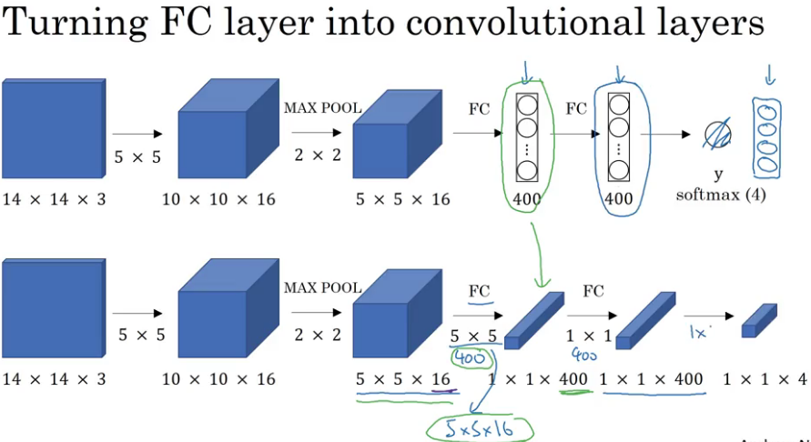

### Sliding windows

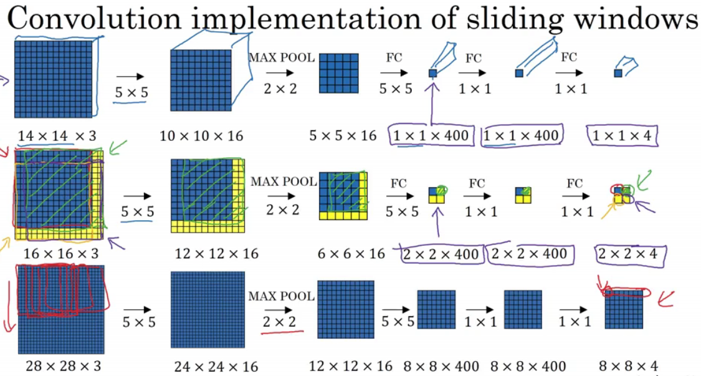

### YOLO

#### IOU (Intersection Over Union)

- yellow area
    
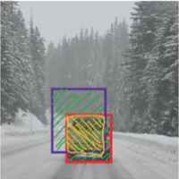

$$IOU = \frac{size \: of \: yellow \: area}{size \: of \: green \: area} $$ 

$$purple: \: predicted \: bounded \: box$$

$$red: \: groundtruth \: bounded \: box$$

$$'correct' \: if \: IOU  \ge 0.5$$

$$better \: with \: 0.6 \: or \: 0.7$$

- Note: recall sth irrelevant: 
    - Precision and Recall
    
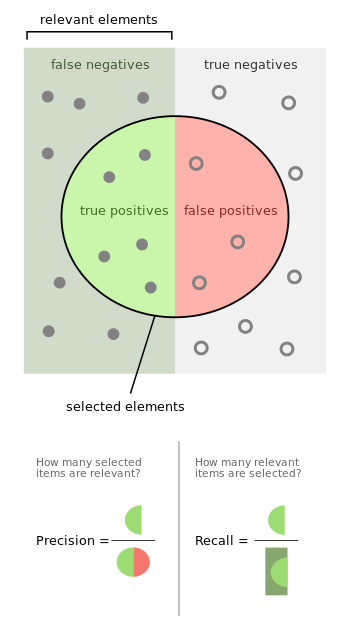

#### Non-max suppression

if the algorithm found multiple detections of the same objects, rather than detecting an object just once, it might detect it multiple times.

__Non-max is a way to make sure that the algorithm detects each object only once__

#### Non-max suppression example

possible problems

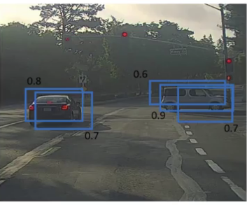

- it first looks at the probabilities associated with  
each of these detections
- then takes the largest one as the most confident detection
- then highlight and say a car is found there
- then __the Non-max suppression part__ looks at all of the remaining rectangles and all the ones with a high overlap
    - for instance: pick out 0.9, suppress 0.6, 0.7; pick out 0.9, suppress 0.7;

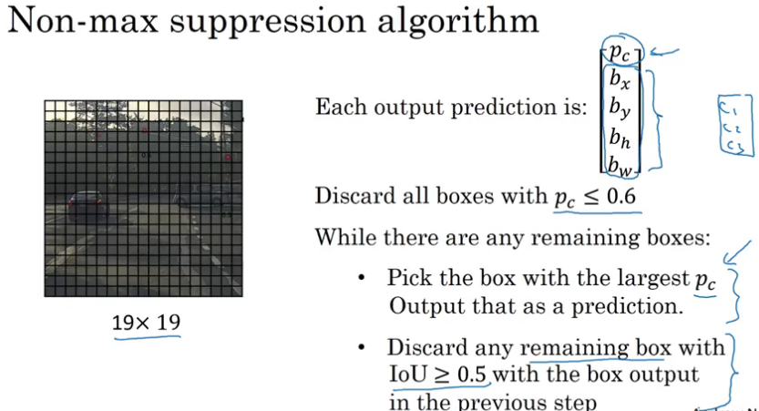
    

#### Anchor Boxes

> what to do when a grid cell wants to detect multiple objects?

__Use Anchor boxes__

- Overlapping objects

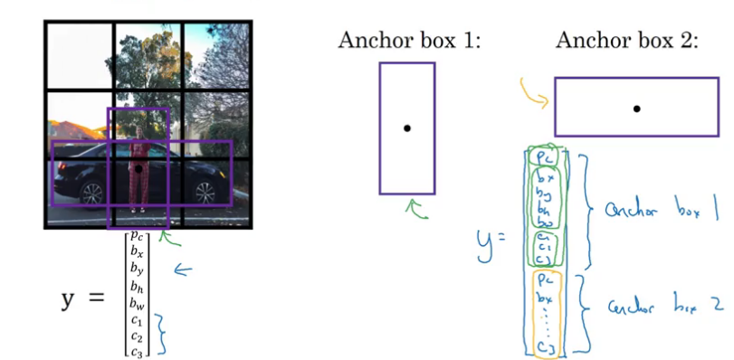

- Previously

Each object in training image is assigned to grid cell that contains that object's midpoint

- Now with 2 anchor boxes

Each object in training image is assigned to a grid cell that contains object's midpoint and anchor box for the grid cell with highest IoU

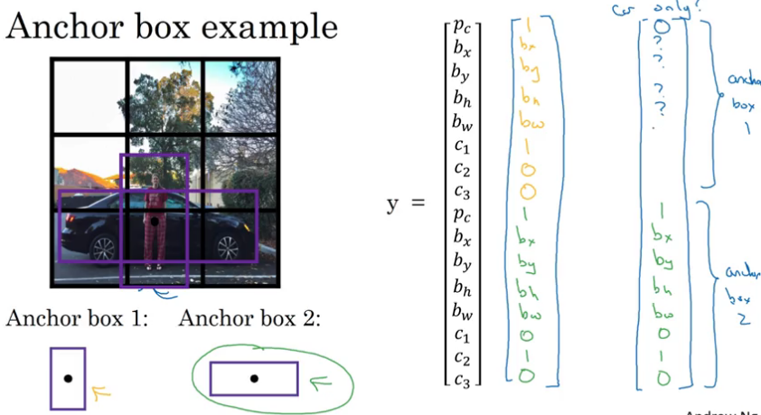
 

> how do you choose anchor boxes?

An advanced way to do this is to use K-means to group together 2 types of objects shapes you tend to get, and then use that to select a set of anchor boxes.

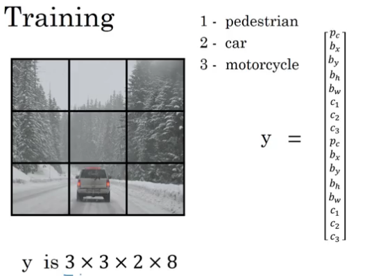

- 3x3: using a 3x3 grid cell, like using sliding window and get 3x3
- 2: anchor boxes
- 8: output classes

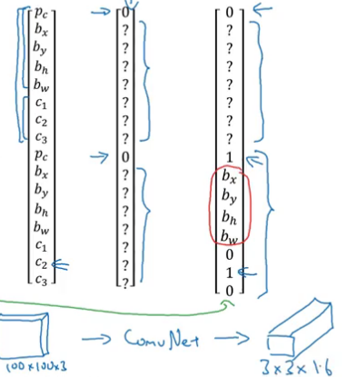

#### Example

- For each grid cell, get 2 predicted bounding boxes

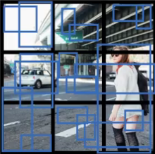

____
- Next get rid of low probability predictions

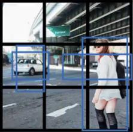
____
- For each class (pedestrian, car, motorcycle) use non-max suppression to generate final predictions

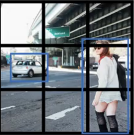

### R-CNN (Region with CNNs)

_rather than running sliding windows on every single window, you instead select just a few windows and to run CNN on_

____

__the region proposals is to run an algorithm called a segmentation algorithm, run CNN on blobs found__

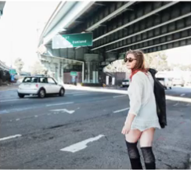

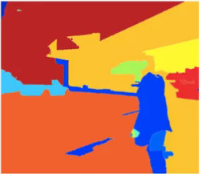

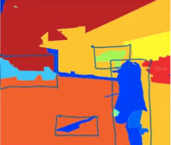

Summary:

- R-CNN
    - Propose regions. 
    - Classify proposed regions one at a time. 
    - Output label+bounding box
 - Fast R-CNN
     - Propose regions.
     - Use convolution implementation of sliding windows to classify all the proposed regions
- Faster R-CNN
    - Use convolutional network to propose regions
- Mask R-CNN
    -  __Faster R-CNN + masks__
    

    
 

 

