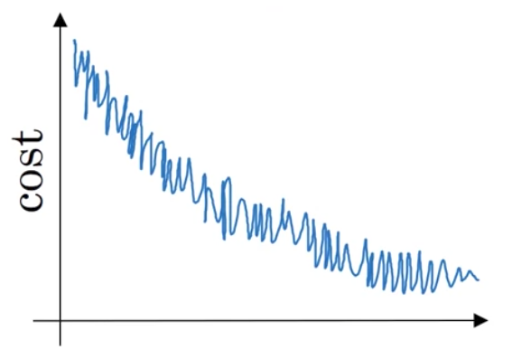

## Mini-batch gradient descent

- cluster a batch as one variable for training

- Cost oscillates when using mini-batch gradient descent

- Choosing your mini-batch size
    - If mini-batch size = m: Batch GD
    - If mini-batch size = 1: Stochastic GD
        - __Every example is its own mini-batch.__
        

- The batch GD might start somewhere and be able to take relatively low noise, large steps, and keep marching to the minimum.
- The stochastic GD can be extremely noisy, won't always converge, always oscillate and wander around the region of the minimum.

__In practice, mini-batch size should be in between [1, n]__

### Gradient descent with momentum

- smooth out the steps of gradient descent
- gradient descent with momentum ends up eventually just taking steps that are much smaller oscillations in the vertical direction

### Root Mean Square Prop (RMSprop)

> How exactly does it work?

- In the W direction, we want the learning to go faster
    - we want Sdw to be relatively __small__so when updating w, we are dividing by relatively small number, so w gets updated faster
- In the b direction, we want to slow down all the oscillations into the vertical direction
    - Sdb will be relatively __large__, so that we are dividing by relatively large number in order to slow down the updates on a vertical direction

And indeed if we look at the derivatives, the derivatives are much larger in the vertical direction than the horizontal direction. So the slope is very large in the b direction.

So with derivatives like this, this is a very large db and a relatively small dw, because the function is sloped much more steeply in the vertical direction.

Thus the net impact of using RMSprop is that 

- updates in the vertical direction are divided by a much larger number, and so that helps damp out the oscillations.
- updates in the horizontal direction are divided by a smaller number, making learning rate larger, moving towards the destination in a faster rate. 

### Adam Optimization

__Combine Momentum and RMSprop together__

- To avoid the case that the steps being noisy and never converge, ends up wandering around the destination, __because we are using some fixed value for learning rate alpha!__

But if we can slowly reduce learning rate alpha, then during the initial phases, while learning rate alpha is still large, we will have relatively fast learning.

But then as alpha gets smaller, the steps we take will be slower and smaller. 

__Note:__

- There will be some oscillations when you're using mini-batch gradient descent since there could be some noisy data example in batches. 

- However batch gradient descent always guarantees a lower ***J*** before reaching the optimal.

