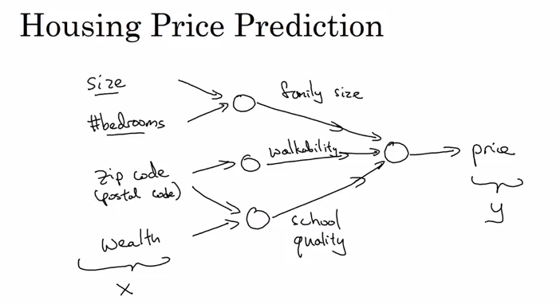

## Week 1

[Geoffrey Hinton interview](https://www.coursera.org/learn/neural-networks-deep-learning/lecture/dcm5r/geoffrey-hinton-interview)

### Intro to Neural Network

- how to start constructng a NN?
   - Eg: Housing Price Prediction: __By stacking together a few of single neurons (simple predictors) __

- what you input and what you get for output?

- finally we formalize the NN:

__Note: every input layer feature is interconnected with every hidden layer feature.__

### Neural Network Examples

- Supervised Learning

- Performance (highly dependent on the scale of data)

   -  __Eg: Algorithmic innovation to boost performance__
   
       - why RELU is better than Sigmoid for Gradient Descent Algorithm?
           - ___Sigmoid___: when x converges to neg infty anf pos infty, the slope of the function (gradient) is nearly 0 => gradient vanishing, so learning becomes really slow, or even stopped, because when we implement the gradient descent and gradient is 0, the parameters just change very slowly;
           - ___RELU___: the gradient is always equal to 1 for all pos value, so the gradient is much less likely to gradually shrink to 0.
