## Neural Network Representation

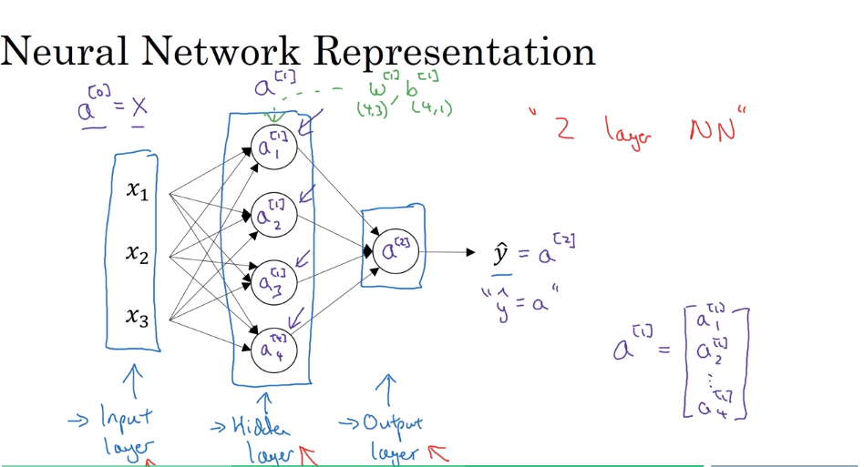

__Notes: the input layer does not count as an official layer(layer 0)__

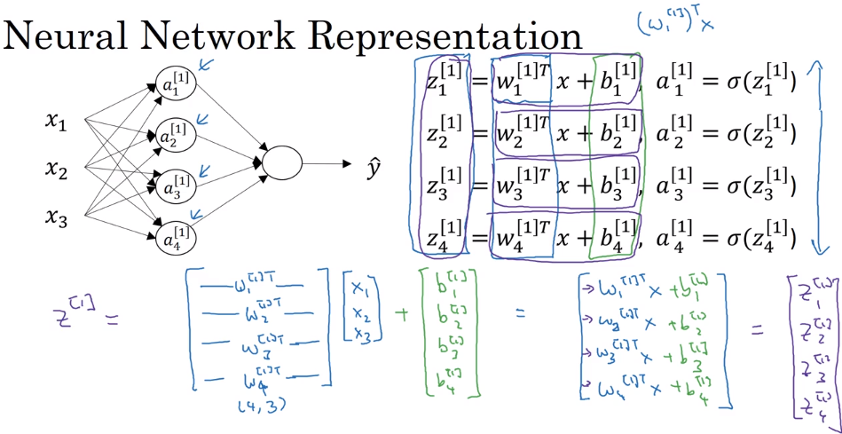

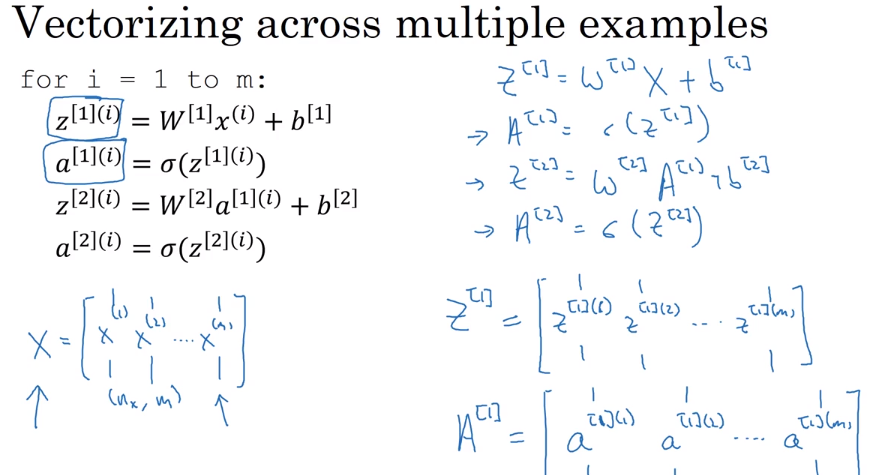

### Further explanation of how the vectorization works: (__pay attention to how the shape changes!__)

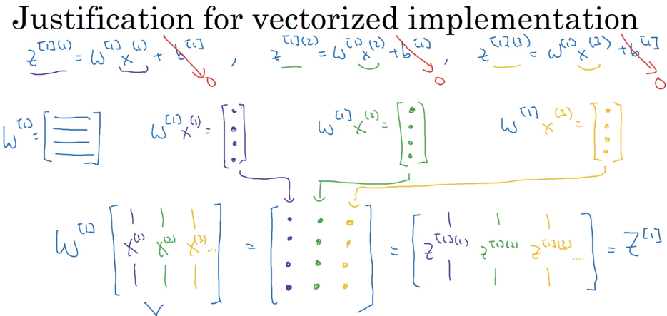

### Activation Function

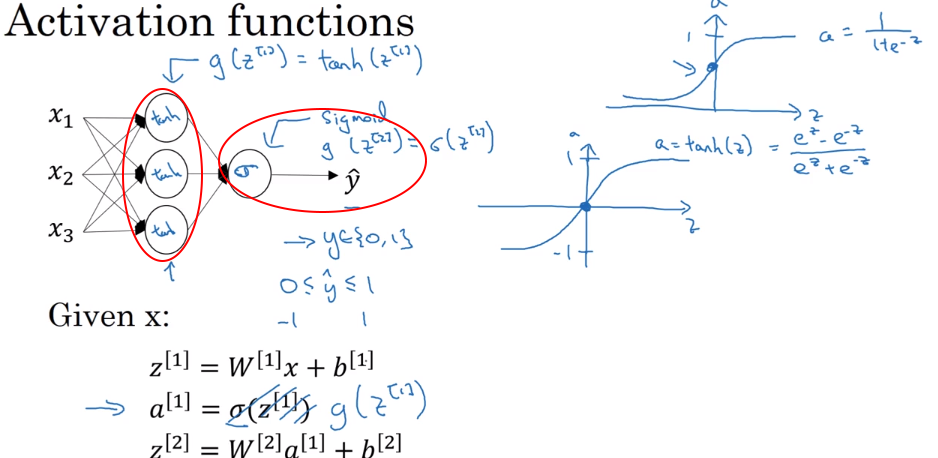
- Seldom use sigmoid, only for binary classification
- can use different activation function at different layers(hidden tanh, output sigmoid)

__Downside__:
- if Z is either very large or very small, then the derivative of the function becomes very small (gradient vanishing)

> How to fix?

__RELU__

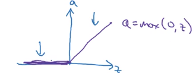

__Rule of thumbs when choosing activation function:__

- if output is 0/1 -> sigmoid
- otherwise, the default choice is always __RELU__
    - and __RELU__ always make model training faster, since less of the effect of the slope of the function slowing down the gradient descent
    
    
__Summary__    
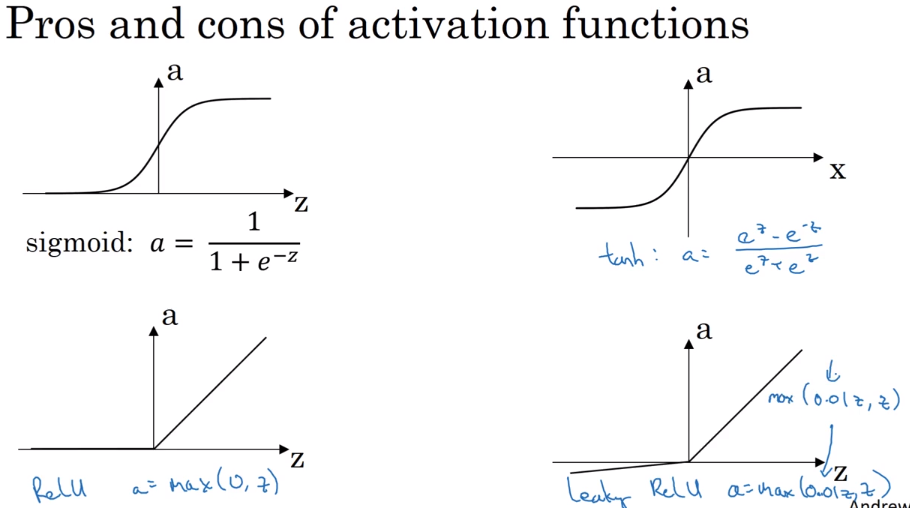    

### Why does NN need a non-linear activation function

 
if not, then you will end up with a linear function in the end. (__Exceptions: sometimes linear activation function could be used in the output layer(fully connected layer)__)

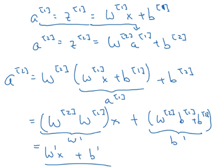 

### Backpropagation

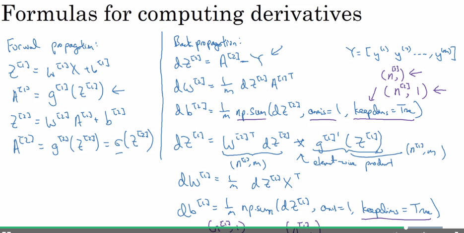 

> Here: 
$$\text{since } \frac{\partial L}{\partial z} = \frac{\partial L}{\partial a}  \cdot \frac{\partial a}{\partial z}$$

$$\text{ so } dz = a-y = da \cdot g'(z), \text{ where } da=\frac{d}{da}L(a,y) = [-y \log a- (1-y) \log (1-a)]' = - \frac{y}{a} + \frac{1-y}{1-a} $$

$$\text{ and when } g(z) = \frac{1}{1+e^{-z}}, g'(z) = g(z)(1-g(z))$$

$$\text{ so, } dz = da \cdot g'(z) = \frac{-y(1-a)+a(1-y)}{a(1-a)} \cdot [a(1-a)] $$

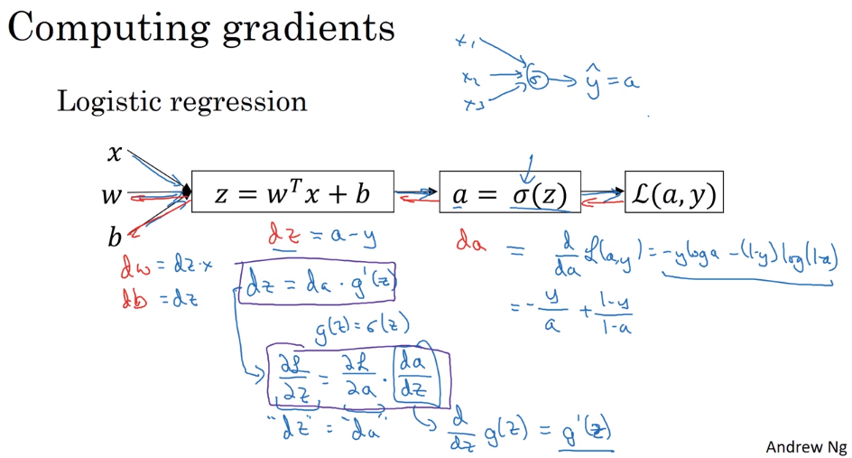 

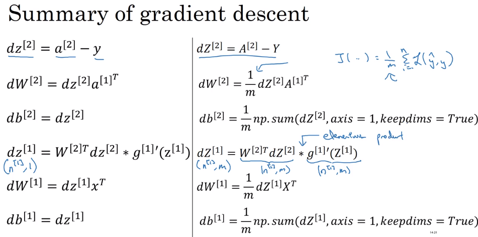 

### Random initialization

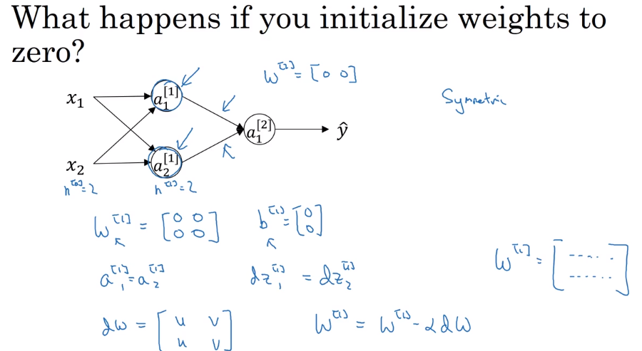

__Symmetric Breaking Problem__

Result: Each neuron in the __first hidden layer__ will perform the same computation. So even after multiple iterations of gradient descent each neuron in the layer will be computing the same thing as other neurons. (__want different hidden units computing different functions__)

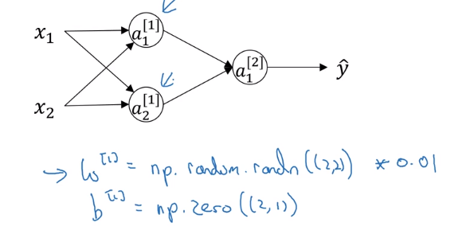

__Note: Make sure w is small to _avoid gradient vanishing___
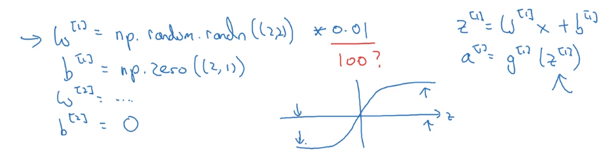

### Other notes

- The tanh activation usually works better than sigmoid activation function for hidden units because the mean of its output is closer to zero, and so it centers the data better for the next layer. (_As seen in lecture the output of the tanh is between -1 and 1, it thus centers the data which makes the learning simpler for the next layer._)

