## Week 2


### Logistic Network


- Logistic network is practically a binary classification

__Note: reshape each image as one single vector__
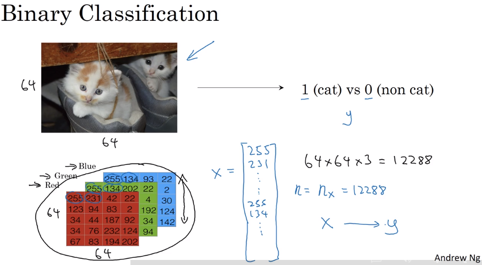
img<src="../images/8.png>
- Notation:

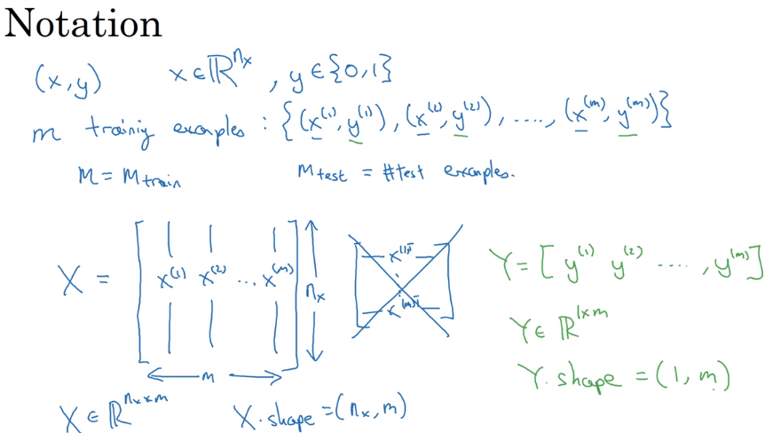

$$\text{ Given the input feature x, where } x \in \mathbb{R}^{n_x}$$

$$\text{  Goal: } \hat y = P(y=1 \mid x), \text{ where }  \hat y \in [0,1]$$

$$\text{ parameter1: } w \in \mathbb{R}^{n_x \cdot ?}  $$

$$\text{ parameter2: } b \in \mathbb{R}^{1 \cdot m}$$

$$\text{ Output: } \hat y = \sigma( w^{T}x + b) = \sigma (z), \text { where } z= w^{T}x+b, \text { and } \sigma(z) = 
\frac{1}{1+e^{-z}}$$

$$\text{ If z is large, } \sigma (z) \approx \frac{1}{1+0} = 1 $$

$$\text{ If z is small (neg), } \sigma (z) \approx \frac{1}{1+\infty} \approx 0 $$

#### alternative notation:
$$x_0 = 1, x \in \mathbb{R}^{n_x+1}, \hat y= \sigma (\theta ^{T} x)$$

$$\text{ where } \theta = \begin{pmatrix} \theta_0
\\ \theta_1
\\ \theta_2
\\ \theta_3
\\ ...
\\ \theta_{n_x}
\end{pmatrix}, \theta_0 \rightarrow b, (\theta_1, \theta_2,..., \theta_{n_x}) \rightarrow w $$


### Logistic Reg Cost  Function


$$\hat y^{(i)} = \sigma (w^{T}x+b), \text{ where } \sigma(z^{(i)}) = \frac{1}{1+e^{-z^{(i)}}} $$

Note: __DO NOT DO THE FOLLOWING:__

$$\text{ Loss(error) function: } L(\hat y, y) = \frac{1}{2} (\hat y - y)^2$$
 
___Because when it comes to learn the parameters, we can find that the optimization problem would become non-convex, so we could end up with optimization problem with multiple local optima, so gradient descent may not find the global optimum___

In Logistic Reg, the standard __loss__ function is:

- Negative log-likelihood (cross-entropy error)

$$L(\hat y, y) = - \left (y \log \hat y + (1-y) \log (1- \hat y) \right )$$

$$\text { If y=1, } L(\hat y, y) = - \log \hat y, \text {so our goal: } \min (L) \rightarrow \max(\hat y) $$
$$\text { If y=0, } L(\hat y, y) = - \log (1- \hat y), \text {so our goal: }  \min (L) \rightarrow \min(\hat y) $$

__Total cost function__:
$$J(w,b) = \frac{1}{m} \sum^m_{i=1} L(\hat y^{(i)}, y^{(i)}) = - \frac{1}{m} \sum^m_{i=1} \left (y^{(i)} \log \hat y^{(i)} + (1-y^{(i)}) \log (1- \hat y^{(i)}) \right )$$

__Note1:__
- The loss function computes the error for a single training example; 
- the cost function is the average of the loss functions of the entire training set.

__Note2: Other loss functions__

- Hinge (SVM, soft margin) 
$$L(y) = \max(0, 1- y), \text{ where if } y>1, \text { then error = 0, the classification output is correct. }  $$
- Squared loss (linear regression) 
- Exponential loss (Boosting) 

### Gradient Descent

Cost Function:
$$J(w,b) = \frac{1}{m} \sum^m_{i=1} L(\hat y^{(i)}, y^{(i)}) = - \frac{1}{m} \sum^m_{i=1} \left (y^{(i)} \log \hat y^{(i)} + (1-y^{(i)}) \log (1- \hat y^{(i)}) \right )$$

__Goal: find w, b that minimize J(w,b)__ 

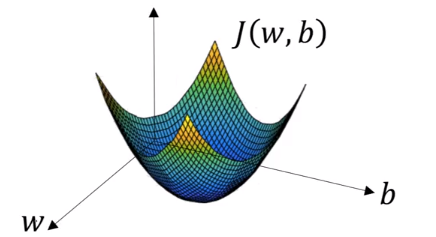

__Initialization: for logistic regression__
- almost any initialization method works (__usually init as 0__)
- random initialization also works

__How Gradient Descent works?__
- start at the initial point and then takes a step in the steepest downhill direction

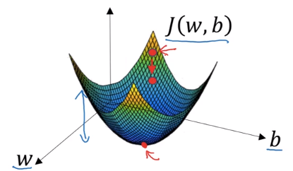

$$\text{Repeated: } w=w-\alpha \frac{\partial J(w, b)}{\partial w},b=b-\alpha \frac{\partial J(w, b)}{\partial b}$$

Eg: 
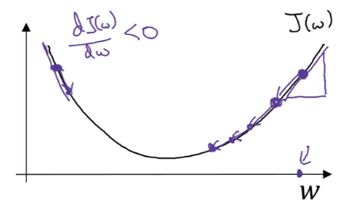

- at this point, the slope here of the derivative would be negative 
- so the gradient descent update would subtract alpha times a negative number, ending up slowly __increasing w__
- so w gets bigger and bigger with successive iteration and gradient descent
- __Vice Versa when you initialize w on the right side__

### Logistic Regression Gradient Descent

- Computing derivatives
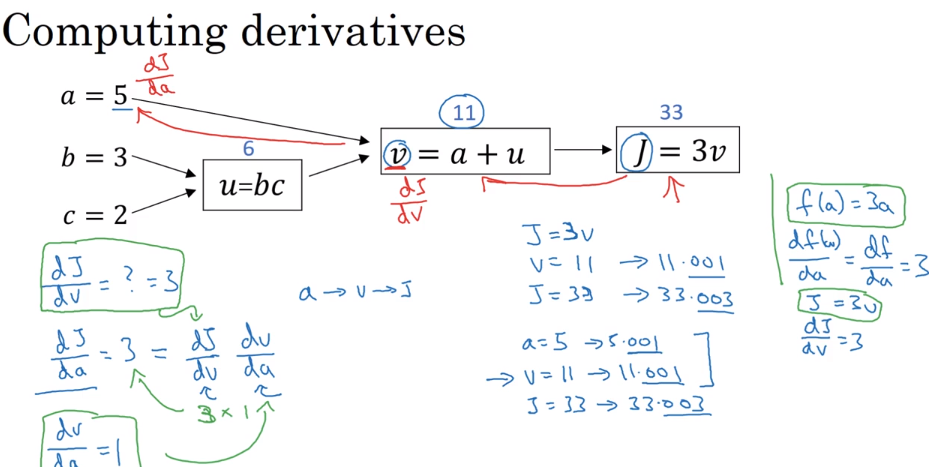

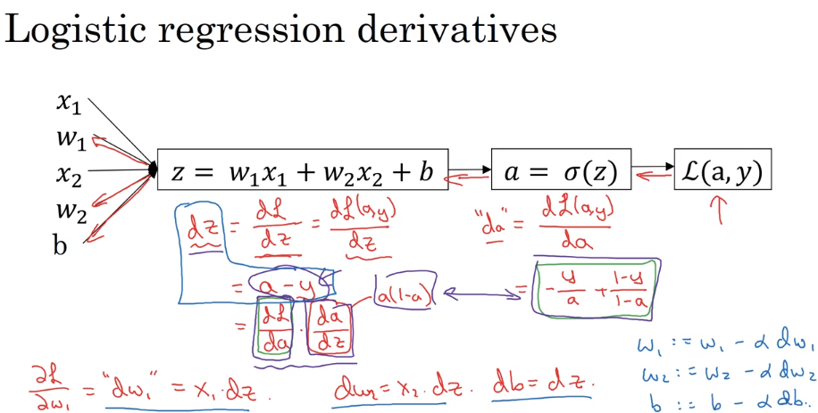

- GD on m examples
    - pseudo code:
    
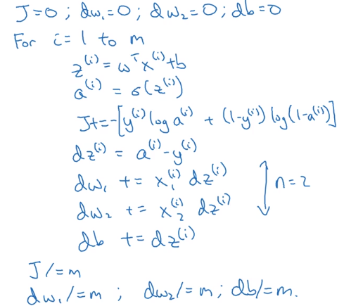   

But, here, if there are too many features (when n not equal to 2), then to avoid the many for loops, should use vectorization.

### Vectorization

Vectorization is the art of getting rid of explicit folders in your code.

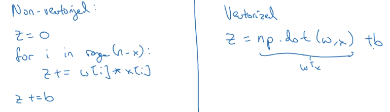

Test:


```python
import numpy as np
import time

number = 1000000
a=np.random.rand(number)
b=np.random.rand(number)

# vectorized:
tic=time.time()
c=np.dot(a,b) # a^T * b
toc=time.time()
toc-tic
```


    0.00103759765625


```python
# for loop:
tic=time.time()
c=0
for i in range(number):
    c+=a[i]*b[i] 
toc=time.time()
toc-tic
```


    0.4118075370788574


__Note1: if 'number' is significantly large, the difference of vectorization and for loop would also be enormous.__

__Note1: Both GPU and CPU have parallelization instructions, called SIMD instructions (single instruction, multiple data)__

if you use a built-in function such as the __np.dot__ function, or any else that does not require explicitly implementing a for loop, it enables numpy to take much better advantage to do computations faster, and it is true for both computations CPUs and computations on GPUs(since GPU really good at SIMD)

### __Take-away: Avoid explicit for-loops__

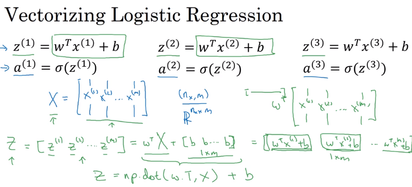

> A subtlety in python: here b is a real number (1 x 1 matrix), python automatically takes this real number B and expands it out to in this case, a 1 x M row vector, it is called __Broadcasting__ in python.

- Vectorizing Logistic Regression
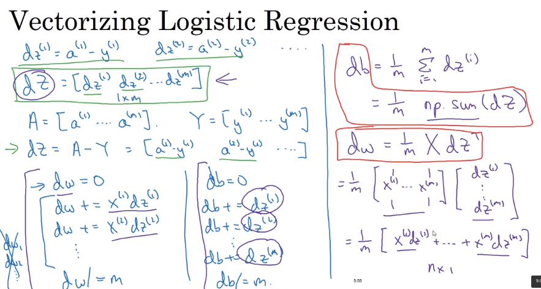
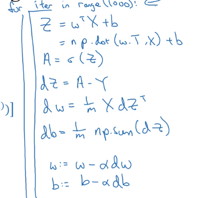


```python
# broadcasting example:
A=np.array([[1,2,3,4],
          [5,6,7,8],
          [4,3,2,1],
          [8,7,6,5]])
A.sum(axis=0) # top to bottom sum
```


    array([18, 18, 18, 18])


```python
A.sum(axis=1) # left to right sum
```


    array([10, 26, 10, 26])


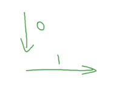


```python
cal = A.sum(axis=0) 
cal_reshaped = cal.reshape(1,4)
cal_reshaped
```


    array([[18, 18, 18, 18]])


```python
A/cal_reshaped * 100 # calculate the precentage
```


    array([[ 5.55555556, 11.11111111, 16.66666667, 22.22222222],
           [27.77777778, 33.33333333, 38.88888889, 44.44444444],
           [22.22222222, 16.66666667, 11.11111111,  5.55555556],
           [44.44444444, 38.88888889, 33.33333333, 27.77777778]])


```python
A/cal * 100
```


    array([[ 5.55555556, 11.11111111, 16.66666667, 22.22222222],
           [27.77777778, 33.33333333, 38.88888889, 44.44444444],
           [22.22222222, 16.66666667, 11.11111111,  5.55555556],
           [44.44444444, 38.88888889, 33.33333333, 27.77777778]])


### MLE & Neg Log Likelihood

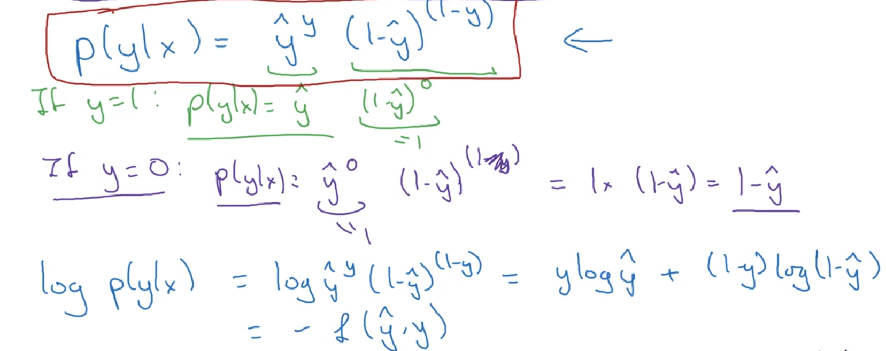

> assumption: 

$$\text{ all training examples } \overset{iid}{\sim} $$

$$P(\text{ labels in training set }) = \prod_{i=1}^m P(y^{(i)} \mid x^{(i)})$$

$$\log P(\text{ labels in training set }) = \log \prod_{i=1}^m P(y^{(i)} \mid x^{(i)})$$

$$\log P(\text{ labels in training set }) = \sum^{m}_{i=1} \log P(y^{(i)} \mid x^{(i)}) = \sum^{m}_{i=1} [-L(\hat y^{(i)}, y^{(i)})]$$

$$\text{ Neg Log Likelihood : } L(\hat y^{(i)}, y^{(i)})$$

> MLE here: 

$$\max (\log P(\text{ labels in training set })) = \max \sum^{m}_{i=1} \log P(y^{(i)} \mid x^{(i)}) = \max \sum^{m}_{i=1} [-L(\hat y^{(i)}, y^{(i)})]$$


$$=> \min \sum^{m}_{i=1} L(\hat y^{(i)}, y^{(i)})$$

> So:
$$ \min (\text{ cost function }) \rightarrow \min(\text{ Neg Log Likelihood } ) \rightarrow \max(- \text{ Neg Log Likelihood } ) \rightarrow MLE$$


```python
a = np.random.randn(4, 3) # a.shape = (4, 3)
b = np.random.randn(3, 2) # b.shape = (3, 2)
c = a*b
```


    ---------------------------------------------------------------------------

    ValueError                                Traceback (most recent call last)

    <ipython-input-41-20aba40ca292> in <module>()
          1 a = np.random.randn(4, 3) # a.shape = (4, 3)
          2 b = np.random.randn(3, 2) # b.shape = (3, 2)
    ----> 3 c = a*b
    

    ValueError: operands could not be broadcast together with shapes (4,3) (3,2) 


```python
c=np.dot(a,b)
c
```
