## Notation

### Name Entity

#### One-Hot

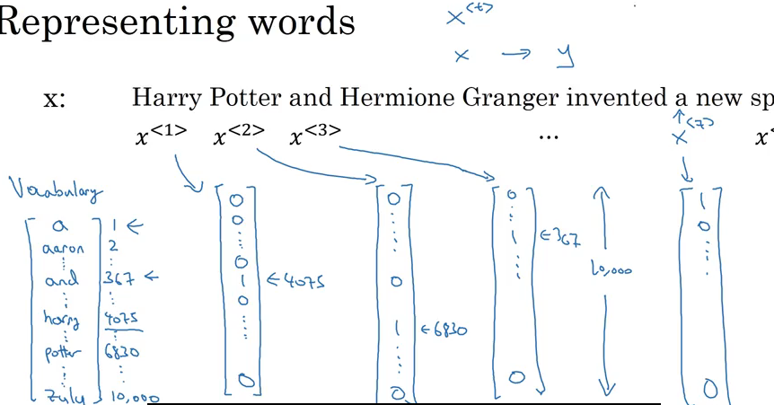

## RNN

> Why not use a standard network?

__Problems:__

- the input and output might thbe different lengths and different examples;
- __a naive neural network architecture like this, it doesn't share features learned across different positions of texts__
- the input layer would be really large
- A weight matrix of this first layer will end up having an enormous number of parameters

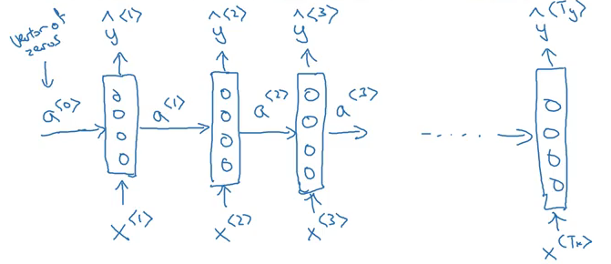

- RNN scans through the data from left to right
- The parameters it uses for each time step are shared

__Process:__

- when making the prediction for y3, it gets info not only from x3 but also the info from x1 and x2 
    - because the info on x1 can pass through activation functions that connected each 2 layers to help to predict with y3

__Weakness:__

- Only use the info that is earlier appeared in the sequence to make predictions
    - when predicting y3, it does not use x4, x5, x6 ... (appear later)
        - it is a problem because in a sentence:   words follows later are more useful fo name detecting this case
        
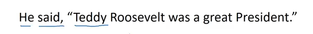 

> How to fix this problem?

Introduce __Bidirectional RNN (BRNN)__

__Forward Propagation__

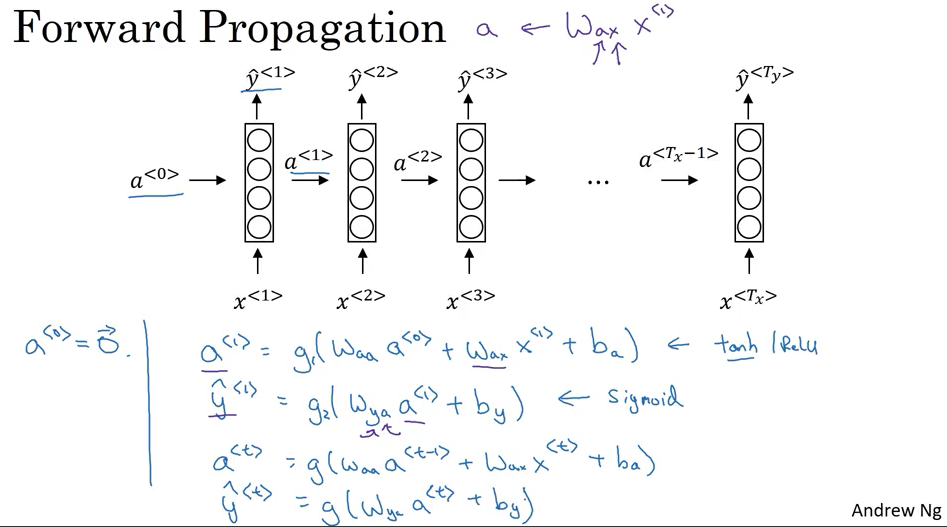

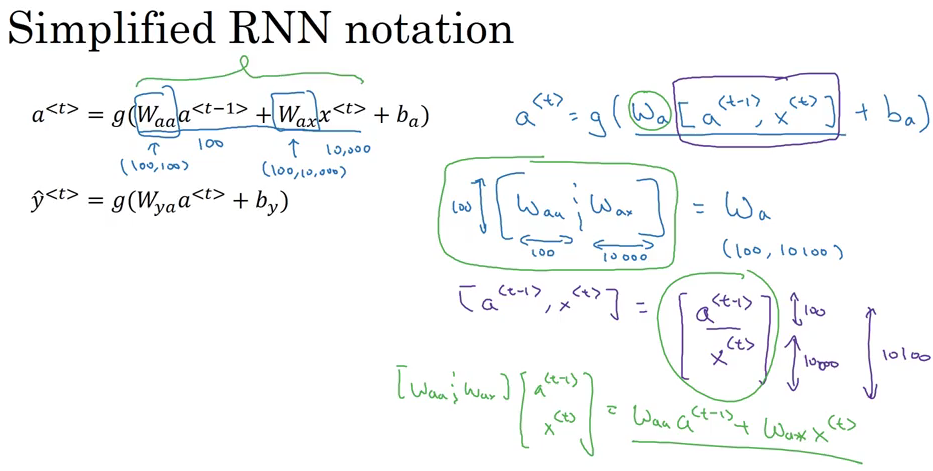

__Cost Function__

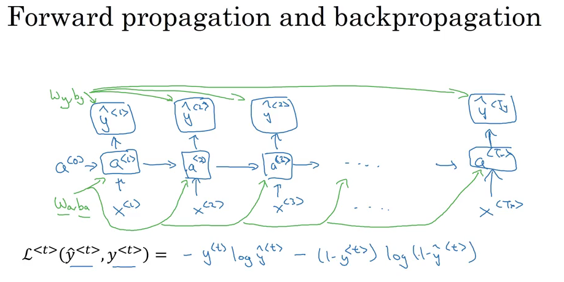

After computing the total cost, then back prop:

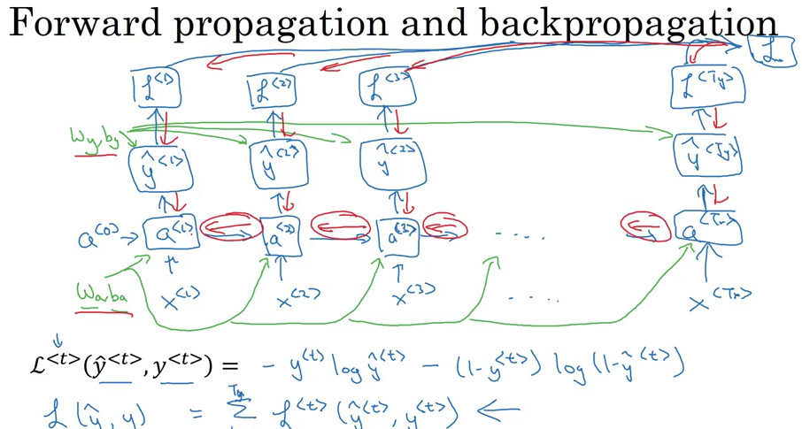

### Different types fo RNN

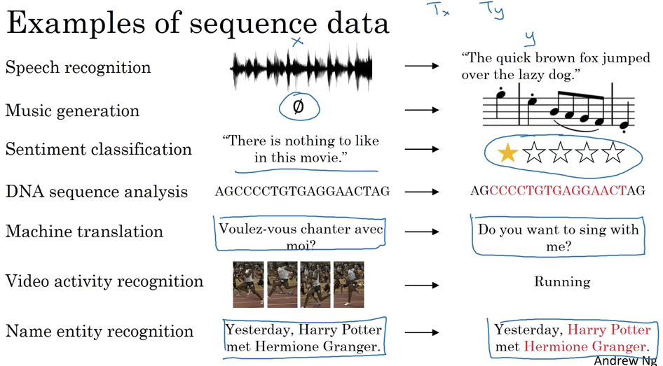

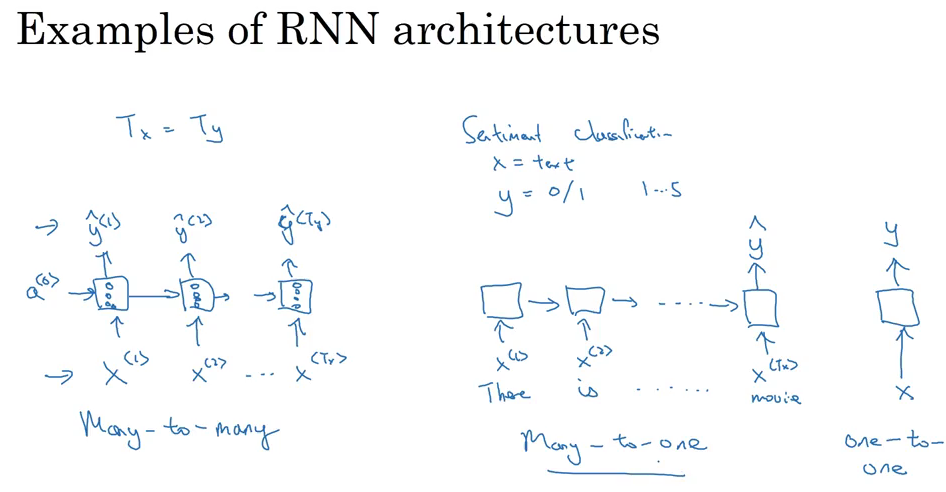

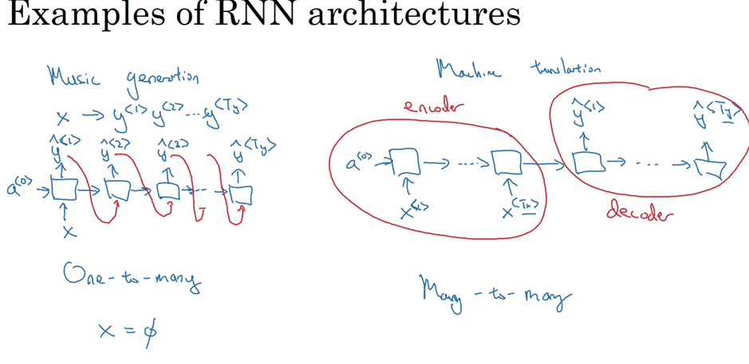

## Language Model

__Language model tells what the probability of a sentence is(how likely does it make snese?)__

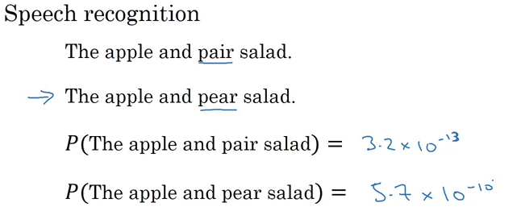

Training set: large corpus of english text

- First Step: __Tokenize the sentence__
    - that means forming a vocabulary
    - then map each of these words to one-hot vectors
    - model when sentences end: add a extra token called a EOS (End of Sentence)
    - replace unknown words in the sentence with 'UNK' (unknown)
- Next Step: build a RNN to model the chance of these different sentences

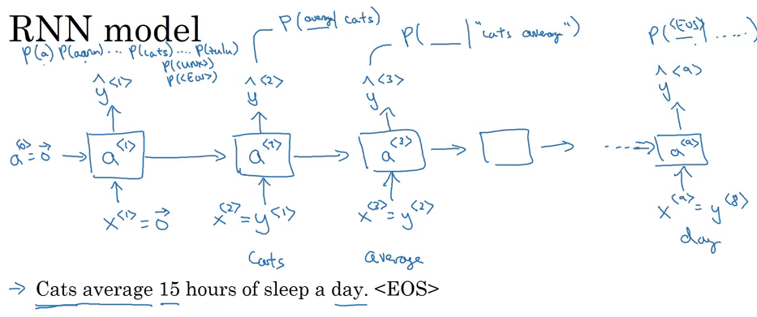

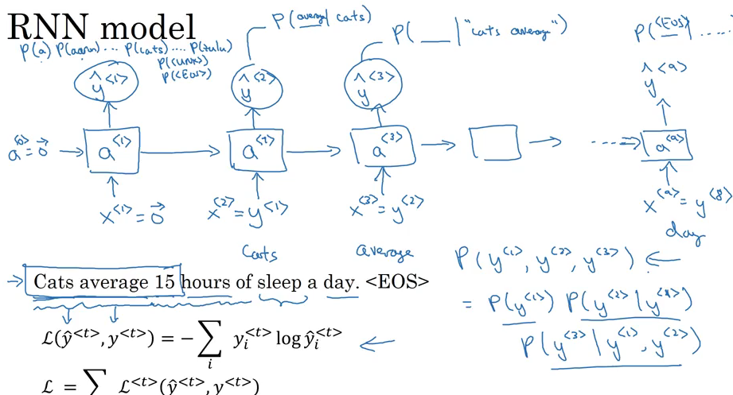

## Sampling a sequence from a trained RNN

Recap that a sequence model models the chances of any particular sequence of words as follows, so what we like to do is sample from this distribution to generate noble sequences fo words.

- First Step: sample what is the first word that you want your model to generate
    - your first time stamp will have some max probability over possible outputs
- Second Step: randomly sample according to the softmax distribution

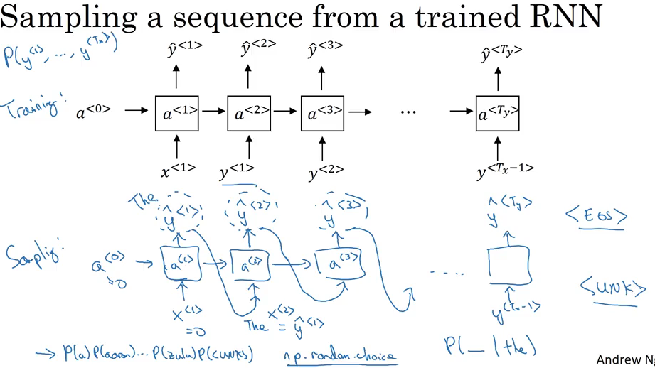

## Vanishing Gradients RNN

### Fail to capture very long-term dependencies

- The cat, which ..., was ...
- The cats, which ..., were ...

> Why?

> Vanishing  gradient while training

__Because of this problem, the basic RNN model has many local influences, meaning that the output is mainly influenced by values close to it.__

> How to detect gradient explosion?

- __'Nans'__ in your results, indicating that results of a numerical overflow in your NN computation
    - Fix: __apply gradient clipping__. Look at your gradient vectors, and if it is bigger than some threshold, _rescale some of the gradients so that it is not too big_

> How to fix vanishing gradient?

Use __GRU__

## GRU

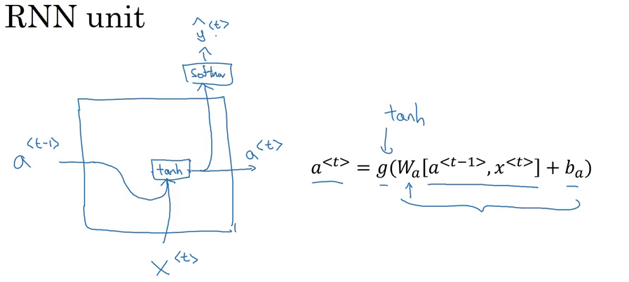

Using the cat example above:

- C: memory cell, to memorize whether it is single or plural so that when it gets much further into the sentence it can still work under consideration

$$c^{<t>} = a^{<t>}$$

- At each time step, overwrite c with :

$$\hat c^{<t>} = \tanh (w_c [c^{t-1}, x^{t}] + b_c)$$

$$\Gamma_u = \sigma (w_u[c^{t-1}, x^{t}] + b_u)$$

$$c^{<t>} = 1 \text{ if single } $$

$$c^{<t>} = 0 \text{ if plural } $$

- And then the GRU unit will memorize the value of the c all the way until verb appears
- The job of the gate (Gamma u) is to decide when to update these values
    - In particular, when we see the phrase, 'the cat', then a new concept the especially subject of the sentence cat. So this would be a good time to update this bit
    - When we done using it, say, after 'The cat... was...' this sentence is finished, then it is time to trigger the Gamma to forget the subject 'cat'
    
$$\Gamma_{u} = 1 \text{ if subject remains } $$

$$\Gamma_{u} = 0 \text{ if sentence ends and subject changes } $$    

$$c^{<t>} = \Gamma_u * \hat c^{<t>} + (1-\Gamma_u) * c^{<t-1>}$$

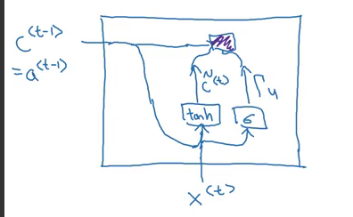

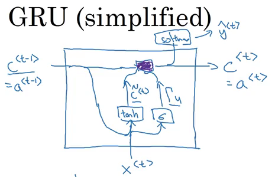

### Full GRU

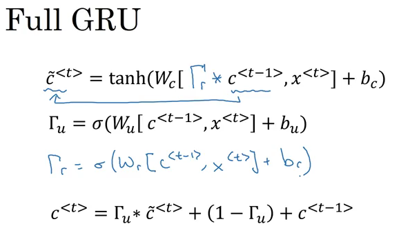

$$ \Gamma r \text{ tells how relevant is } c^{<t-1>}$$

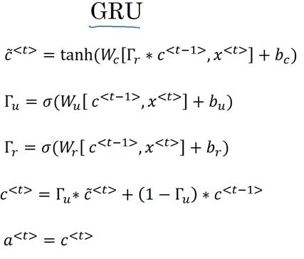

## LSTM

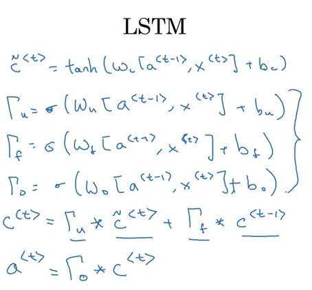

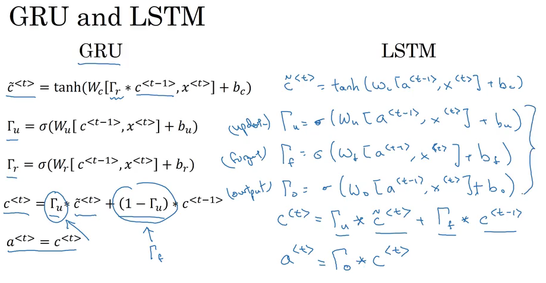

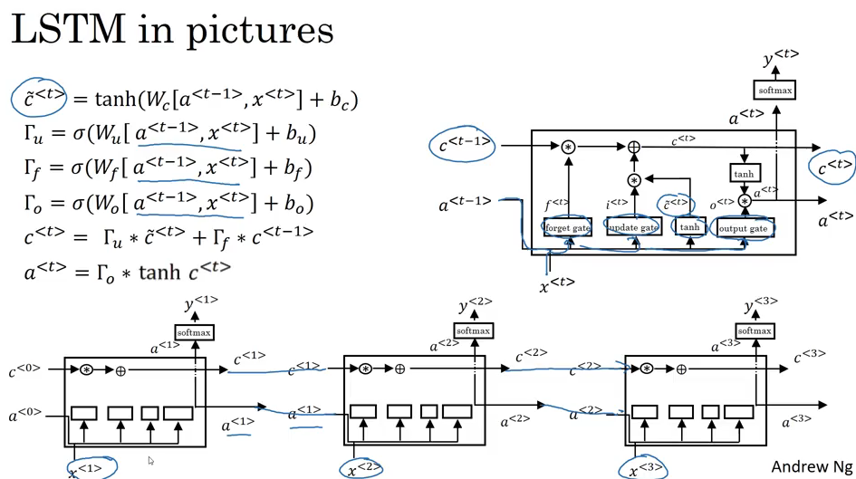

## BRNN

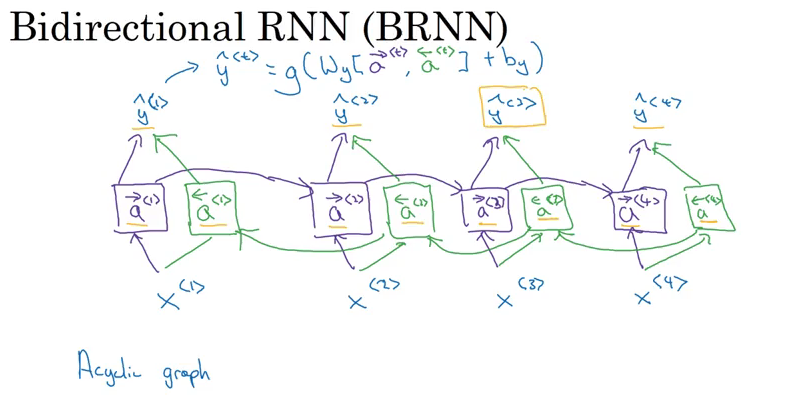
