## Seq2seq Model

### Image captioning (similar logic to seq2seq)

#### AlexNet

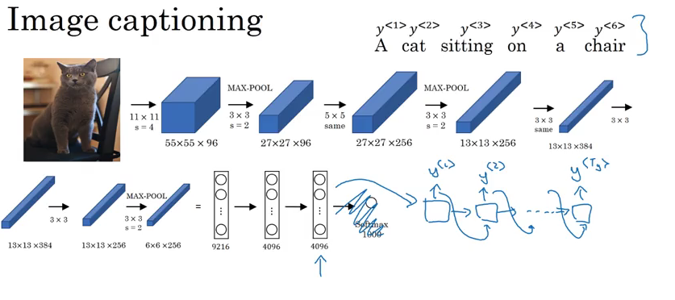

### Difference between language model and machine translation

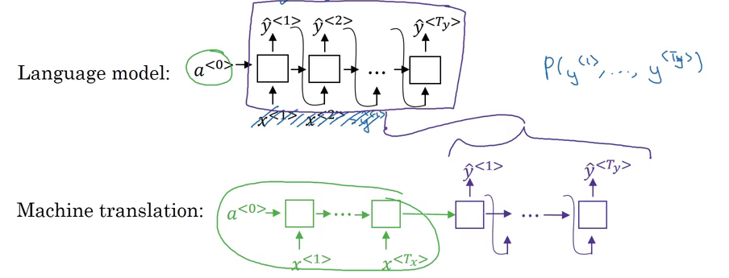

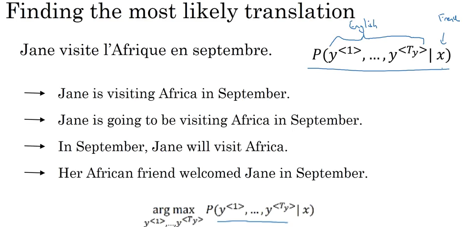

### Beam Search
 
> Why not use greedy search?

> Greedy search will pick only one  most likely word  and move on; Beam search will instead can consider multiple alternatives. 

After picking 3 most likely words for the first word:

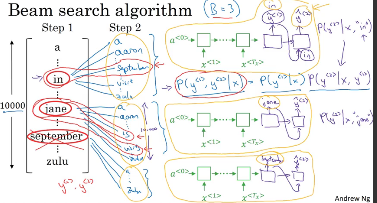

> Beam search: combination of greedy search? greedy at each step

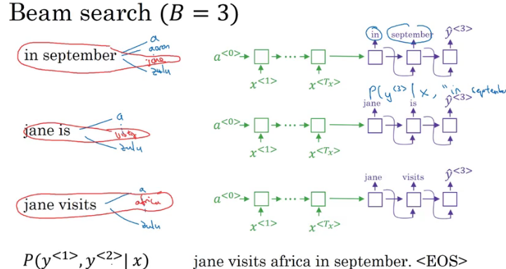

### Refinements to Beam Search

#### Length normalization

$$\arg \max \prod^{T_y}_{t=1} P(y^{<t>} \mid x, y^{<1>}, y^{<2>}, ..., y^{<t-1>})$$

$$ P( y^{<1>}, y^{<2>}, ..., y^{<t>} \mid x) = P(y^{<1>} \mid x) P(y^{<2>} \mid x, y^{<1>}) P(y^{<3>} \mid x, y^{<1>}, y^{<2>})... P(y^{<t>} \mid x, y^{<1>}, y^{<2>}, ..., y^{<t-1>}) $$

$$= \prod^{T_y}_{t=1} P(y^{<t>} \mid x, y^{<1>}, y^{<2>}, ..., y^{<t-1>})$$

__Since multiplying a lot of numbers less than 1 will result in a tiny number, which can result in numerical underflow (too small for the floating part representation in computer to store accuratly__

> So, in practice, take log

$$\arg \max \prod^{T_y}_{t=1}\log P(y^{<t>} \mid x, y^{<1>}, y^{<2>}, ..., y^{<t-1>})$$

> To significantly reduce the penalty of very long sentence translation:

$$\frac{1}{T_y^\alpha} \:\:\: \prod^{T_y}_{t=1}\log P(y^{<t>} \mid x, y^{<1>}, y^{<2>}, ..., y^{<t-1>})$$

### Error Analysis of beam search

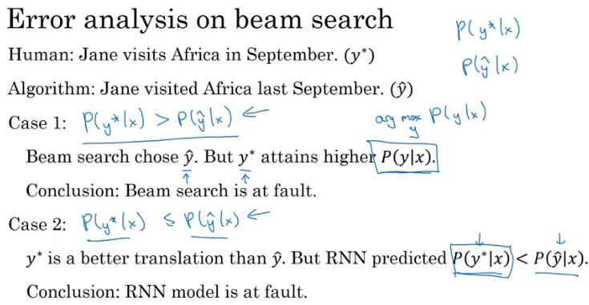

### Bleu Score (Bilingual evaluation)

#### Unigram

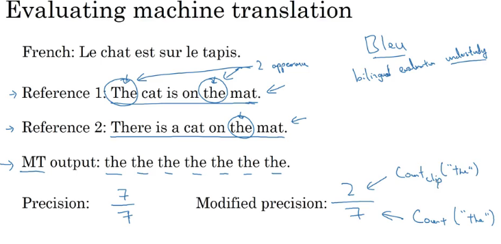

$$\text{ modified precision }\frac{\text{ occurence of the word in the original sentence}}{\text{ occurence of the word in the translation output}}$$

#### Bigram

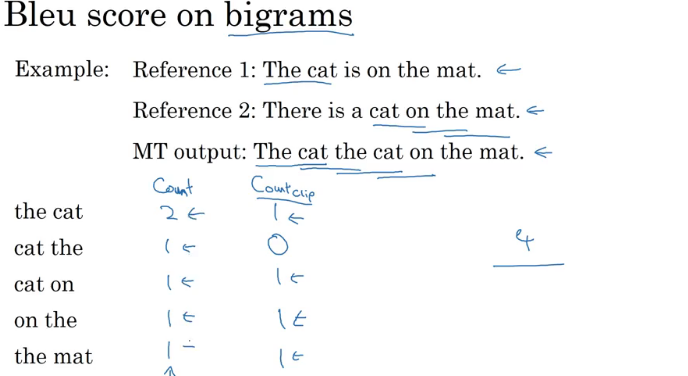

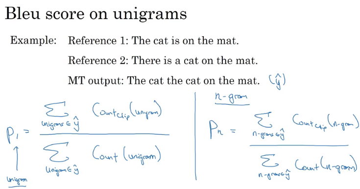

$$p_n = \text{ Bleu score on n-grams only }$$

$$\text{ Combined Bleu Score: } \exp ( \frac{1}{4} \sum^4_{n=1} p_n )$$

Since the shorter the sentence is, the more accurate it will be, thus we should add a __brevity penalty__

$$\text{If MT_output_length > reference_output_length, } BP = 1 $$

$$\text{If MT_output_length }\le \text { reference_output_length, }$$

$$BP = \exp (1- \frac{MT_output_length }{reference_output_length})$$

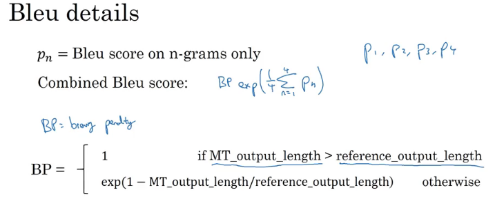

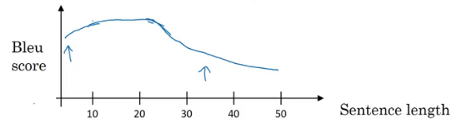

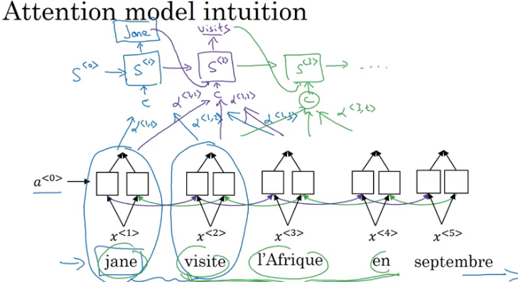

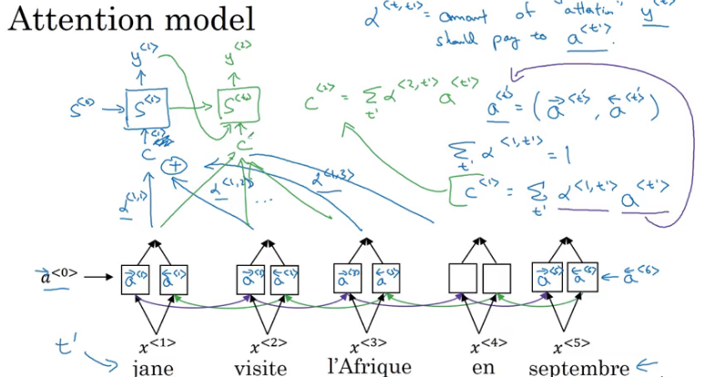

$$\text{ Compute attention } \alpha ^{<t, t'>\text{ the amount of attention } y^{<t>} should pay to } a^{t'} $$

$$\alpha ^{<t, t'>} = \frac{\exp (e^{<t, t'>})}{\sum^{T_x}_{t' = 1}\exp (e^{t, t'})}$$

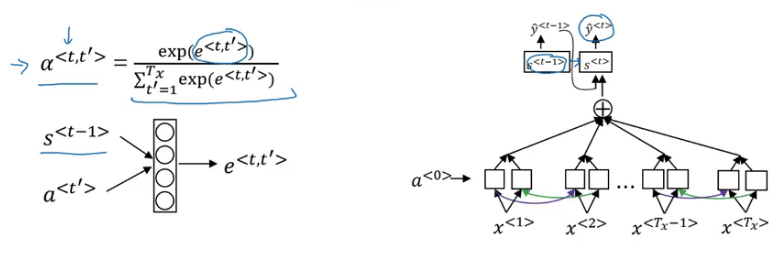

